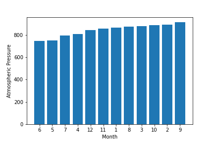
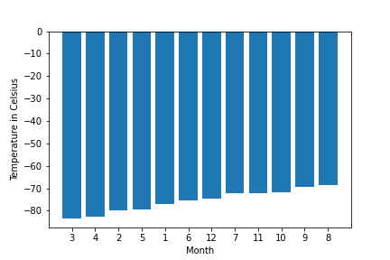
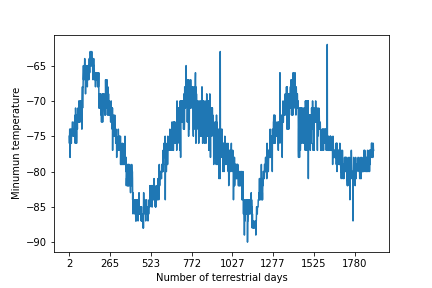

# Mission-to-Mars

## This project is taking on the full web-scraping and data analysis for the mission to Mars. We will identify HTML elements on a page, identify their id and class attributes, and use this knowledge to extract information via both automated browsing with Splinter and HTML parsing with Beautiful Soup. We will also scrape various types of information. These include HTML tables and recurring elements, like multiple news articles on a webpage.

[MARS NASA News](https://redplanetscience.com/)
[MARS Temperature Data](https://data-class-mars-challenge.s3.amazonaws.com/Mars/index.html)

### core skills: collecting data, organizing and storing data, analyzing data, and then visually communicating your insights.

- Weather on Mars is crucially to be considered, thus, we will mainly do pressure and temperature analysis.

  
  - As we can see from the graph that the average pressure by month on Mars is from 750 to 900. In particular, pressure in June is lowest over the year whilist pressure in September is the highest.
  
  
  
   - As we can see from the graph that the average min temperature by month on Mars is from -86 to -68. In particular, temperature in June is lowest over the year whilist temperature in September is the highest.
  
  

   - This picture shows the min temperature over the year and it shows cycling.
 
 
